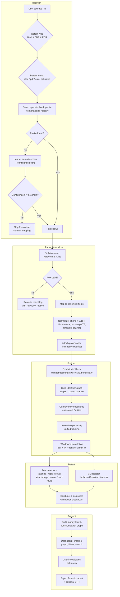
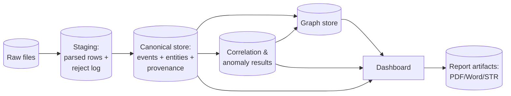

# 04 — Workflow Document

**Project:** AI-Powered Financial & Telecom Dataset Analyzer (Bank, CDR & IPDR Fusion)
**Problem Statement ID:** ERH26_PS_03 · **Domain:** Big Data and Analytics
**Document status:** Batch B · Draft 1 · 2026-07-06

---

## 1. Purpose

To define the complete end-to-end workflow of the system — from raw file upload through parsing,
normalization, fusion, detection, visualization, and reporting — including data flow, decision points,
processing stages, and error handling.

## 2. Objective

Give the engineering team a single, diagrammed process model where every stage maps to requirement IDs
(Doc 02), so implementation can follow the flow without re-deriving it.

## 3. Scope

Covers the batch processing pipeline for the three input types and the interactive
dashboard/reporting flow. Excludes internal class/function design (Doc 07) and phasing (Doc 08).

---

## 4. High-Level Workflow

```mermaid
flowchart LR
    A[Upload files<br/>Bank / CDR / IPDR] --> B[Ingestion &<br/>Format Detection]
    B --> C[Parse &<br/>Schema Mapping]
    C --> D[Normalize to<br/>Canonical Model]
    D --> E[Entity Resolution<br/>& Linkage]
    E --> F[Unified Timeline<br/>Construction]
    F --> G[Temporal<br/>Correlation]
    G --> H[Anomaly & Pattern<br/>Detection + Risk Scoring]
    H --> I[Graph / Network<br/>Build]
    I --> J[Interactive Dashboard<br/>Timeline + Graph + Search]
    J --> K[Forensic Report<br/>Export PDF/Word + STR]
```

**Stage-to-requirement mapping:**

| Stage | Requirements |
|-------|--------------|
| Ingestion & Format Detection | FR-1..4 |
| Parse & Schema Mapping | FR-1..5, NFR-1 |
| Normalize to Canonical Model | FR-6, FR-7, NFR-7 |
| Entity Resolution & Linkage | FR-10 |
| Unified Timeline | FR-8 |
| Temporal Correlation | FR-9, NFR-2 |
| Anomaly & Risk | FR-11, FR-12, FR-13, NFR-3 |
| Graph / Network | FR-14, FR-18 |
| Dashboard | FR-14, FR-15, NFR-4 |
| Report Export | FR-16, FR-17, NFR-7 |

## 5. Detailed Workflow

## 6. Data Flow

**Canonical event record (conceptual — detailed in Doc 06):** every parsed row becomes an `Event`
of type `TRANSACTION | CALL | IP_SESSION`, carrying a resolved `entity_id`, a normalized `timestamp`,
type-specific fields, and a `provenance` block. Entities and their links are stored separately and
referenced by `entity_id`.

## 7. Processing Stages (summary table)

| # | Stage | Input | Output | Key logic |
|---|-------|-------|--------|-----------|
| 1 | Ingestion | Raw file | Typed, profiled file | Type + format + profile detection |
| 2 | Parse | Profiled file | Raw rows | Library per format (pdfplumber/pandas) |
| 3 | Validate | Raw rows | Valid rows + rejects | Field rules (Doc 06) |
| 4 | Normalize | Valid rows | Canonical events | E.164, TZ, decimal, provenance |
| 5 | Entity resolution | Canonical events | Entities + links | Identifier graph → components |
| 6 | Timeline | Events + entities | Per-entity timeline | Sort by normalized ts |
| 7 | Correlation | Timeline | Coincidence hits | Windowed join (W configurable) |
| 8 | Detection | Events + graph | Flags + risk scores | Rules + Isolation Forest |
| 9 | Graph build | Entities + flows | Network graph | NetworkX (cycles/centrality) |
| 10 | Present | All results | Dashboard views | Timeline + graph + search/filter |
| 11 | Report | Selected findings | PDF/Word/STR | Templated export + provenance |

## 8. Decision Points

| DP | Where | Decision | Outcomes |
|----|-------|----------|----------|
| DP-1 | Ingestion | Dataset type? | Bank / CDR / IPDR pipeline |
| DP-2 | Ingestion | Known profile? | Use profile / auto-detect |
| DP-3 | Auto-detect | Confidence ≥ threshold? | Proceed / manual mapping |
| DP-4 | Validate | Row valid? | Normalize / reject-log |
| DP-5 | Correlation | Within window W? | Record coincidence / skip |
| DP-6 | Detection | Rule hit or anomaly? | Raise flag + contribute to score |
| DP-7 | Report | Include STR? | Generate STR / skip (optional) |

## 9. Inputs & Outputs (workflow-level)

- **Inputs:** Bank statement files (xlsx/pdf/csv), CDR files, IPDR files; user filter/search/query
  parameters; configuration (window W, thresholds, profiles).
- **Outputs:** Canonical events, resolved entities & links, correlation hits, anomaly flags + risk
  scores, network graphs, dashboard views, exported forensic report / STR.

## 10. Error Handling

| Error class | Handling strategy | Requirement |
|-------------|-------------------|-------------|
| Unsupported/unknown format | Reject file with clear message; offer manual mapping | FR-5, NFR-1 |
| Unmappable columns (low confidence) | Route to manual-mapping UI; do not silently guess | FR-4, FR-5 |
| Invalid/malformed row | Send to reject log with row number + reason; continue processing | FR-5, NFR-1 |
| Ambiguous timestamp/timezone | Apply default TZ per profile; flag as assumption on record | FR-7 |
| Duplicate records | Deduplicate on natural key; keep provenance of all sources | NFR-7 |
| Entity-linkage conflict | Keep deterministic links only; flag fuzzy candidates for review | FR-10, NFR-2 |
| Empty correlation/detection result | Report "no findings" explicitly (not an error) | NFR-4 |
| Report generation failure | Retry; fall back to raw data export; never lose provenance | FR-16 |

**Principles:** fail *per record*, not per file (partial success is valuable); never silently drop
data (everything rejected is logged); preserve provenance through every stage (NFR-7).

## 11. Assumptions

- `[Assumption]` Processing is **batch** (upload → process → explore), not streaming. (PS implies this.)
- `[Assumption]` Default correlation window **W = 10 minutes** (from the PS bonus example), overridable.
- `[Assumption]` Auto-detection **confidence threshold** is a tunable config value (e.g., 0.8).
- `[Assumption]` CDR/IPDR are structured/delimited files (confirmed by PS owner, 2026-07-06).

## 12. Dependencies

- Canonical model & validation rules from `06_data_understanding.md`.
- Component boundaries from `05_system_understanding.md` and `07_architecture_planning.md`.
- Detection thresholds from `11_question_log.md` (Q5, working defaults).

## 13. Risks

- Auto-detection false mappings → wrong correlations; mitigated by confidence threshold + manual path.
- Window W mis-set → missed/false coincidences (NFR-2); mitigated by configurability.

## 14. Best Practices

- Idempotent, restartable stages; each stage reads its input store and writes its output store.
- Provenance is written once (stage 4) and carried immutably thereafter.
- Configuration (W, thresholds, profiles) externalized, never hard-coded (NFR-6).

## 15. Future Considerations

- Streaming/near-real-time ingestion; parallel/distributed processing for very large datasets.
- Feedback loop: analyst confirms/dismisses flags to tune detectors over time.

## 16. References

- `02_requirement_analysis.md`, `05_system_understanding.md`, `06_data_understanding.md`,
  `07_architecture_planning.md`, `11_question_log.md`.
