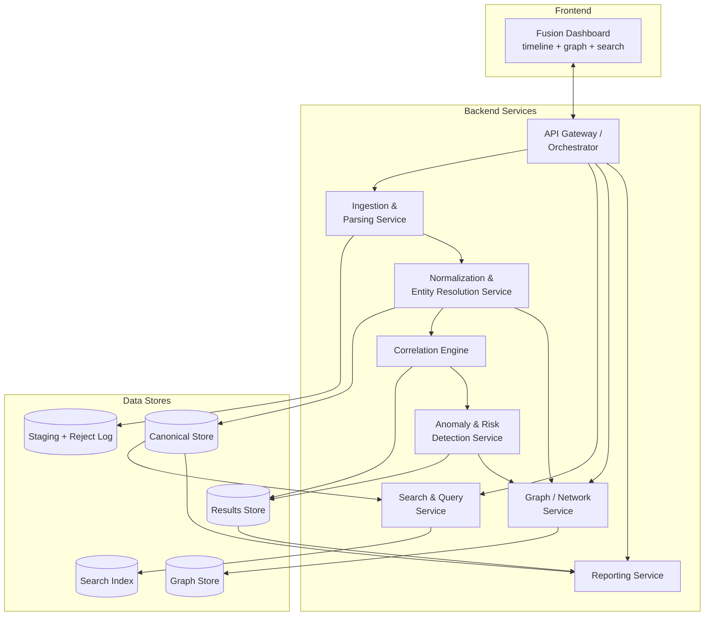
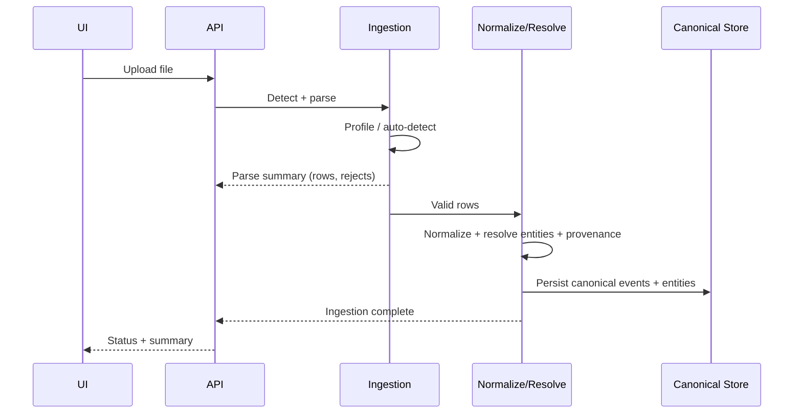
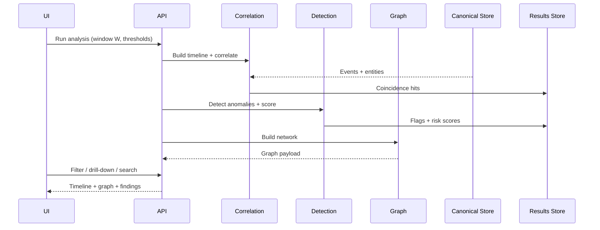
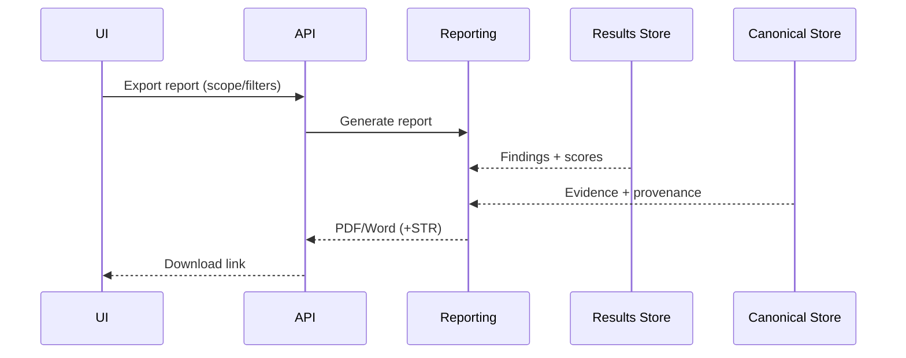

# 05 — System Understanding Document

**Project:** AI-Powered Financial & Telecom Dataset Analyzer (Bank, CDR & IPDR Fusion)
**Problem Statement ID:** ERH26_PS_03 · **Domain:** Big Data and Analytics
**Document status:** Batch B · Draft 1 · 2026-07-06

---

## 1. Purpose

To describe the overall system as a set of collaborating components — their responsibilities,
interactions, and internal workflow — providing the conceptual bridge between requirements (Doc 02) /
workflow (Doc 04) and the technical architecture (Doc 07).

## 2. Objective

Give every stakeholder a shared mental model of *"what parts exist and how they cooperate"* before
diving into technology and code structure.

## 3. Scope

Logical component view and interactions. Technology bindings, deployment topology, and folder layout
are in Docs 07 and 09.

---

## 4. Overall System

**ERakshak** is a **forensic data-fusion analytics system**. It takes heterogeneous financial and
telecom records, unifies them into one entity-and-timeline model, correlates events across datasets,
detects suspicious patterns, and presents interactive networks plus an exportable forensic report.

Logically it is a **batch analytics pipeline** feeding an **interactive investigation frontend**:

## 5. Major Components & Responsibilities

| Component | Responsibility | Requirements |
|-----------|----------------|--------------|
| **API Gateway / Orchestrator** | Entry point for the UI; orchestrates the pipeline; exposes query/report endpoints | All (coordination) |
| **Ingestion & Parsing Service** | Detect type/format, select profile, parse rows, produce reject log | FR-1..5, NFR-1 |
| **Normalization & Entity Resolution Service** | Map to canonical model, normalize values, attach provenance, resolve entities via shared identifiers | FR-4, FR-6, FR-7, FR-10, NFR-7 |
| **Correlation Engine** | Build per-entity unified timeline; detect temporal coincidences within window W | FR-8, FR-9, NFR-2 |
| **Anomaly & Risk Detection Service** | Run rule detectors + ML; compute risk scores with factor breakdown | FR-11, FR-12, FR-13, NFR-3 |
| **Graph / Network Service** | Build money-flow & communication graphs; cycles, centrality, communities; drill-down data | FR-10, FR-14, FR-18 |
| **Search & Query Service** | Filter/search by entity, amount, time, location; (optional) NL query | FR-15, FR-19 |
| **Reporting Service** | Generate forensic PDF/Word with charts + evidentiary timeline; optional STR | FR-16, FR-17, NFR-7 |
| **Fusion Dashboard (Frontend)** | Timeline view, network graph, filters, drill-down, export trigger | FR-14, FR-15, NFR-4 |
| **Configuration** | Window W, thresholds, mapping profiles | NFR-6 |

## 6. Data Stores (logical)

| Store | Holds | Notes |
|-------|-------|-------|
| **Staging + Reject Log** | Raw parsed rows; rejected rows with reasons | Auditable ingestion (NFR-1) |
| **Canonical Store** | Normalized events + entities + links + provenance | Source of truth (NFR-7) |
| **Results Store** | Correlation hits, anomaly flags, risk scores | Feeds dashboard + report |
| **Graph Store** | Entity/flow graph | In-memory (NetworkX) or Neo4j (optional) |
| **Search Index** | Indexed fields for fast filter/search | Postgres indexes or Elasticsearch (optional) |

## 7. Component Interactions (request flows)

**A. Ingest a dataset**

**B. Run fusion & explore**

**C. Export report**

## 8. Internal Workflow (recap, tied to Doc 04)

Ingestion → Normalization/Entity-Resolution → Timeline → Correlation → Detection → Graph → Present →
Report. Each backend service owns one stage, reads its input store, writes its output store, and is
independently testable. The Orchestrator sequences them and the Dashboard consumes the results.

## 9. Assumptions

- `[Assumption]` Services are logically separate but may be deployed as one application (modular
  monolith) for the prototype; microservice split is optional at scale (see Doc 07).
- `[Assumption]` Graph and search start in-process (NetworkX / Postgres indexes); Neo4j/Elasticsearch
  are optional scale upgrades.
- `[Assumption]` A single authorized investigator uses one analysis workspace at a time (no
  multi-tenant concurrency requirement stated).

## 10. Dependencies

- Canonical model definitions from `06_data_understanding.md`.
- Technology bindings from `07_architecture_planning.md`.
- Workflow/error semantics from `04_workflow.md`.

## 11. Risks

- Tight coupling between correlation and detection could reduce testability — mitigated by the
  store-in / store-out boundary per service.
- In-memory graph/search limits at scale — mitigated by the optional Neo4j/ES upgrade path.

## 12. Best Practices

- One responsibility per component; communicate via well-defined stores/contracts, not shared state.
- Keep the Orchestrator thin (sequencing only); business logic lives in the services.
- Make each service runnable/testable in isolation with fixture data.

## 13. Future Considerations

- Split heavy services (detection, graph) into separate workers if scale demands.
- Introduce a job queue for long-running batch analysis.

## 14. References

- `02_requirement_analysis.md`, `04_workflow.md`, `06_data_understanding.md`,
  `07_architecture_planning.md`.
