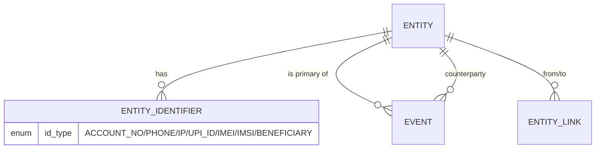

# 06 — Data Understanding Document

**Project:** AI-Powered Financial & Telecom Dataset Analyzer (Bank, CDR & IPDR Fusion)
**Problem Statement ID:** ERH26_PS_03 · **Domain:** Big Data and Analytics
**Document status:** Batch B · Draft 1 · 2026-07-06

---

> **IMPORTANT — modeled schemas.** No datasets were provided. Per direction from the PS owner
> (2026-07-06), this document models the **expected/canonical** schemas for Bank statements, CDR, and
> IPDR based on standard Indian banking and telecom export conventions. **Every field list below is an
> `[Assumption]`** to be validated against real samples (Question Log Q1–Q3). CDR/IPDR are confirmed to
> be structured/delimited files.

## 1. Purpose

To define the data the system consumes — every dataset, every field, relationships, validation rules,
preprocessing, feature engineering, and likely issues — so parsing, normalization, correlation, and
detection can be built against a concrete data contract.

## 2. Objective

Establish the **canonical data model** and per-source **mapping targets** that all parsers map into,
and enumerate the transformations and features needed downstream.

## 3. Scope

The three input datasets (Bank, CDR, IPDR) and the canonical model they normalize into. Storage
schema/technology is in Doc 07.

---

## 4. Canonical Data Model (the fusion target)

All sources normalize into two core tables plus a link table. This is the single model referenced by
Docs 04, 05, 07.

### 4.1 `Entity`
| Field | Type | Description |
|-------|------|-------------|
| `entity_id` | UUID | Resolved entity (connected component of identifiers) |
| `entity_type` | enum | `PERSON` / `ACCOUNT` / `PHONE` / `IP` / `UNKNOWN` |
| `display_label` | string | Human label (e.g., masked account / number) |
| `risk_score` | float | Computed (FR-12); null until detection runs |
| `identifiers` | list | Linked identifiers (see `EntityIdentifier`) |

### 4.2 `EntityIdentifier`
| Field | Type | Description |
|-------|------|-------------|
| `entity_id` | UUID | FK → Entity |
| `id_type` | enum | `ACCOUNT_NO` / `PHONE` / `IP` / `UPI_ID` / `IMEI` / `IMSI` / `BENEFICIARY` |
| `id_value` | string | Normalized value |
| `source` | enum | `BANK` / `CDR` / `IPDR` |

### 4.3 `Event` (the unified timeline record)
| Field | Type | Description | Applies to |
|-------|------|-------------|-----------|
| `event_id` | UUID | Unique | all |
| `event_type` | enum | `TRANSACTION` / `CALL` / `IP_SESSION` | all |
| `entity_id` | UUID | Primary resolved entity | all |
| `counterparty_entity_id` | UUID | Other party (payer/payee, callee) | txn, call |
| `timestamp_start` | datetime (TZ-normalized) | Event start | all |
| `timestamp_end` | datetime | Event end | call, ip_session |
| `amount` | decimal | Transaction amount | txn |
| `direction` | enum | `CREDIT` / `DEBIT` (txn); `IN` / `OUT` (call) | txn, call |
| `attributes` | json | Type-specific fields (below) | all |
| `provenance` | json | `{source_file, sheet, row, offset, profile}` | all (NFR-7) |

### 4.4 `EntityLink`
| Field | Type | Description |
|-------|------|-------------|
| `from_entity_id` | UUID | Entity A |
| `to_entity_id` | UUID | Entity B |
| `link_type` | enum | `MONEY_FLOW` / `COMMUNICATION` / `SHARED_IDENTIFIER` |
| `shared_id_type` | enum | UPI_ID / IP / IMEI / beneficiary (when SHARED_IDENTIFIER) |
| `weight` | number | Count/amount aggregate for graph edges |

---

## 5. Dataset 1 — Bank Statements

**Format:** Excel (.xlsx/.xls), PDF, CSV. Layouts vary by bank. *(FR-1)*

### 5.1 Expected fields `[Assumption]`
| Source field (typical) | Canonical target | Type | Notes |
|------------------------|------------------|------|-------|
| Transaction Date / Value Date | `timestamp_start` | date/datetime | Two dates common; use txn date, keep value date in attributes |
| Narration / Description / Particulars | `attributes.narration` | string | Free text; source of UPI ID, beneficiary, mode |
| Debit / Withdrawal | `amount` + `direction=DEBIT` | decimal | |
| Credit / Deposit | `amount` + `direction=CREDIT` | decimal | |
| Balance / Closing Balance | `attributes.balance` | decimal | Sanity-check running balance |
| Cheque/Ref No / Transaction ID / UTR | `attributes.ref_no` | string | UTR/RRN for tracing |
| Account Number (header/holder) | identifier `ACCOUNT_NO` | string | Often in statement header, not per row |
| Mode (UPI/NEFT/IMPS/RTGS/ATM) | `attributes.mode` | enum | Parsed from narration if not explicit |
| Beneficiary / Payee | identifier `BENEFICIARY` | string | Often embedded in narration |
| UPI ID (VPA) | identifier `UPI_ID` | string | Extracted from narration (e.g., `name@bank`) |

### 5.2 Notes
- Account number & holder are usually in the **statement header block**, not each row → parser must
  bind header identity to every row.
- Narration is semi-structured; UPI VPA, beneficiary, UTR, and mode are frequently **embedded in
  free text** and need pattern extraction (regex) `[Assumption]`.

---

## 6. Dataset 2 — CDR (Call Detail Records)

**Format:** structured/delimited (CSV/Excel/text) from operators. *(FR-2)*

### 6.1 Expected fields `[Assumption]`
| Source field (typical) | Canonical target | Type | Notes |
|------------------------|------------------|------|-------|
| Calling Party Number (A-party) | `entity` identifier `PHONE` | string | Normalize to E.164 |
| Called Party Number (B-party) | `counterparty` identifier `PHONE` | string | |
| Call Date/Time (start) | `timestamp_start` | datetime | TZ-normalize |
| Duration (sec) | `timestamp_end` (start+dur) / `attributes.duration` | int | |
| Call Type | `direction` / `attributes.call_type` | enum | MOC/MTC/SMS-O/SMS-T (out/in/sms) |
| IMEI | identifier `IMEI` | string | Device linkage (FR-10) |
| IMSI | identifier `IMSI` | string | SIM linkage |
| First/Last Cell ID (CGI/LAC) | `attributes.cell_id` | string | Location (FR-15) |
| Cell tower lat/long or site name | `attributes.location` | geo/string | If provided |
| Roaming / Circle | `attributes.circle` | string | |

### 6.2 Notes
- CDR gives **communication edges** (A→B) and **device/SIM identifiers** (IMEI/IMSI) that link numbers
  to the same person (FR-10).
- "Location" for filtering (FR-15, Q8) comes from **cell ID / tower** here.

---

## 7. Dataset 3 — IPDR (Internet Protocol Detail Records)

**Format:** structured/delimited from operators. *(FR-3)*

### 7.1 Expected fields `[Assumption]`
| Source field (typical) | Canonical target | Type | Notes |
|------------------------|------------------|------|-------|
| Subscriber ID / MSISDN | `entity` identifier `PHONE` | string | Links IPDR to CDR/subscriber |
| Assigned/Private IP | identifier `IP` | string | Canonicalize |
| Public/NAT IP + Port range | identifier `IP` + `attributes.port` | string/int | CGNAT resolution needs IP+port+time |
| Session Start Time | `timestamp_start` | datetime | TZ-normalize |
| Session End Time | `timestamp_end` | datetime | |
| Duration | `attributes.duration` | int | |
| Data Volume (up/down bytes) | `attributes.bytes_up/down` | int | Behavioral feature |
| Destination IP / Domain | `attributes.dest_ip` | string | If present |
| IMEI / IMSI | identifier `IMEI` / `IMSI` | string | Device linkage |

### 7.2 Notes
- IPDR ties a **subscriber/number to an IP over a time interval** — essential for the "online from a
  particular IP" leg of the call+IP+transfer coincidence (FR-9).
- **CGNAT** means a public IP is shared; resolving *who* used an IP requires **public IP + source
  port + exact timestamp** (RFC 6302). Parser must retain port + precise time.

---

## 8. Relationships (across datasets)

**Cross-dataset linkage keys (FR-10):**

| Shared identifier | Links | Present in |
|-------------------|-------|-----------|
| `PHONE` (MSISDN) | CDR subscriber ↔ IPDR subscriber | CDR, IPDR |
| `IMEI` / `IMSI` | Number ↔ device/SIM ↔ another number | CDR, IPDR |
| `IP` | IPDR session ↔ (online moment) | IPDR |
| `UPI_ID` / `BENEFICIARY` / account | Bank account ↔ payee/actor | Bank |
| Time coincidence | Bank txn ↔ CDR call ↔ IPDR session within W | all (via timeline) |

The **bridge between finance and telecom** is primarily *time coincidence* plus any **phone number
that appears both as a bank UPI/registered number and as a CDR/IPDR subscriber** `[Assumption]` — the
availability of this bridge should be validated with real samples (Q3).

## 9. Validation Rules

| Field | Rule |
|-------|------|
| Phone number | Valid Indian MSISDN; normalize to E.164 (+91…) ; reject non-numeric |
| IP address | Valid IPv4/IPv6; canonical form |
| Timestamp | Parseable; within plausible range; TZ resolved (default IST) |
| Amount | Non-negative decimal; currency assumed INR `[Assumption]` |
| Duration | Non-negative integer seconds |
| IMEI | 15 digits (Luhn optional); IMSI 15 digits |
| UPI VPA | Matches `handle@bank` pattern |
| Running balance (bank) | Optional consistency check: prev balance ± amount = balance |
| Required fields | Row rejected (with reason) if a mandatory canonical field is unmappable |

## 10. Possible Preprocessing

- **Header/profile detection** and column mapping into canonical fields (FR-4).
- **Phone normalization** to E.164; strip separators, handle 0/+91 prefixes.
- **Timestamp normalization** to a single timezone; unify date+time columns.
- **Amount parsing**: strip currency symbols/commas; unify debit/credit into amount+direction.
- **Narration mining** (bank): regex-extract UPI VPA, UTR/RRN, beneficiary, mode.
- **Deduplication** on natural keys (e.g., UTR for txns; A+B+start for calls).
- **Provenance stamping** on every record (NFR-7).
- **Reject-log routing** for invalid/unmappable rows (FR-5).

## 11. Possible Feature Engineering (for FR-11/12/13)

Per-entity and per-window aggregates feeding rules + Isolation Forest:

| Feature | Signal for |
|---------|-----------|
| Txn count / total in & out per time bucket | Rapid in-and-out, mule |
| In/out amount ratio & net flow | Pass-through (mule) behavior |
| Time-to-forward (credit → subsequent debit gap) | Layering, rapid in-and-out |
| Count of counterparties (fan-in/fan-out) | Structuring, mule hub |
| Share of amounts just below a reporting threshold | Structuring/smurfing |
| Presence in a graph cycle | Circular flow |
| Distinct IPs/IMEIs per number | Identity linkage / SIM-box |
| Call-then-transfer coincidence count | Cross-dataset suspicion |
| Night/odd-hour activity ratio | Behavioral anomaly |
| Centrality in money-flow graph | Key-actor ranking |

## 12. Possible Issues (data quality)

| Issue | Impact | Handling |
|-------|--------|----------|
| Inconsistent bank layouts / merged cells in Excel/PDF | Parse failures | Profile registry + manual mapping |
| Narration free-text variance | Missed UPI/beneficiary extraction | Robust regex + review flag |
| Timezone/format ambiguity | Wrong correlation | Default TZ per profile + flag |
| CGNAT shared public IPs | Wrong IP→subscriber attribution | Require IP+port+time; caveat in report |
| Missing linkage between bank & telecom | Fusion has no bridge | Rely on time coincidence; log gap (Q3) |
| Duplicate/overlapping records | Double counting | Dedup on natural keys |
| Number format variants (0/+91/spaces) | Failed entity linkage | Strict E.164 normalization |
| PII sensitivity | Compliance risk | Masking in UI + access control (NFR-8) |
| Large file sizes | Memory pressure | Chunked parsing; DB offload at scale |

## 13. Assumptions (summary)

- `[Assumption]` All source field lists (§5–§7) are modeled, not observed — validate with samples (Q1–Q3).
- `[Assumption]` Currency is INR; timestamps default to IST when TZ absent.
- `[Assumption]` The finance↔telecom bridge exists via shared phone numbers and/or time coincidence.
- `[Assumption]` "Location" = cell ID (CDR) / IP-geo (IPDR) (Q8).

## 14. Dependencies

- Parsers/profiles in Ingestion service (Doc 05, 07) implement these mappings.
- Detection features (§11) depend on Correlation + Graph outputs.
- Blocked for final precision on Q1–Q3, Q5, Q8 (Question Log).

## 15. Risks

- Modeled schemas may diverge from real exports → parser rework (top risk, Doc 10).
- Weak finance↔telecom bridge would limit fusion quality (NFR-2) — needs sample validation.

## 16. Best Practices

- One canonical model; parsers are thin mappers into it.
- Never discard raw values — keep them in `attributes`/provenance for evidentiary review.
- Normalize aggressively (phone/IP/time/amount) *before* correlation.

## 17. Future Considerations

- Add datasets (KYC, crypto, device logs) as new sources mapping into the same canonical model.
- Enrichment: IP geolocation, operator/circle lookup, sanctions/watchlist matching.

## 18. References

- `02_requirement_analysis.md`, `03_initial_research.md`, `04_workflow.md`, `11_question_log.md`.
- RFC 6302 (IP+port+timestamp identity); FATF typologies (structuring/layering).
