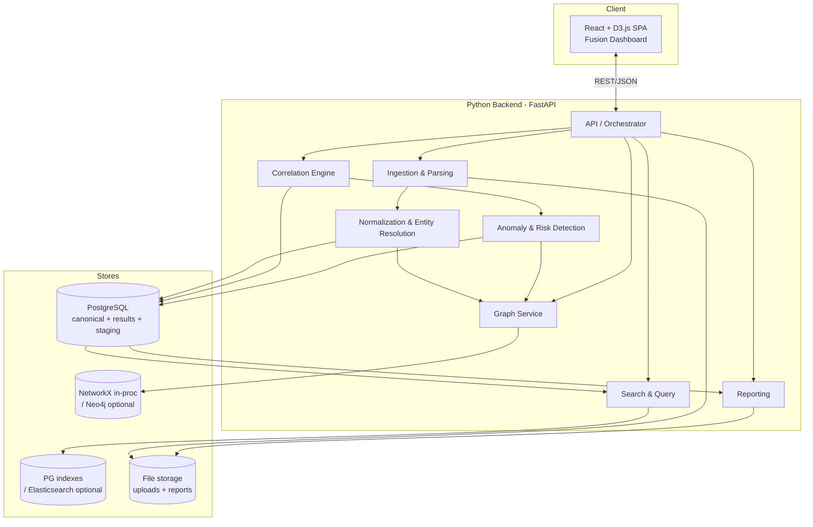

# 07 — Architecture Planning Document

**Project:** AI-Powered Financial & Telecom Dataset Analyzer (Bank, CDR & IPDR Fusion)
**Problem Statement ID:** ERH26_PS_03 · **Domain:** Big Data and Analytics
**Document status:** Batch B · Draft 1 · 2026-07-06

---

## 1. Purpose

To design the system's architecture — high-level structure, component/module breakdown, service
responsibilities, data stores, and the justified technology choices that realize the requirements
(Doc 02), workflow (Doc 04), components (Doc 05), and data model (Doc 06).

## 2. Objective

Produce an implementation-ready architecture in which every technology is chosen *because* it satisfies
a specific requirement, with optional/scale-triggered upgrades clearly separated from the core.

## 3. Scope

Logical + physical architecture, module breakdown, tech stack with rationale, and deployment view for
the prototype. Detailed data schemas are in Doc 06; folder layout in Doc 09.

---

## 4. Architectural Style

**Recommendation: a modular monolith (Python backend) + SPA frontend for the prototype**, with clean
service boundaries that allow later extraction into separate workers/microservices.

**Reasoning.** The PS asks for a working prototype/demo ingesting three dataset types (BR-4). A modular
monolith gives fast development, simple deployment, and easy debugging while the service boundaries
from Doc 05 keep each stage independently testable and extractable if scale demands (NFR-5, NFR-10).
A premature microservice split would add ops overhead without a stated scale requirement (Q7).

## 5. High-Level Architecture



## 6. Component Architecture & Module Breakdown

| Module | Sub-modules | Responsibility | Requirements |
|--------|-------------|----------------|--------------|
| `ingestion` | `type_detector`, `format_detector`, `profile_registry`, `parsers/{excel,pdf,csv,delimited}`, `reject_log` | Detect + parse into raw rows | FR-1..5, NFR-1 |
| `normalization` | `field_mapper`, `value_normalizers/{phone,ip,datetime,amount}`, `narration_extractor`, `provenance` | Map + normalize + stamp provenance | FR-4, FR-6, FR-7, NFR-7 |
| `entity_resolution` | `identifier_extractor`, `identity_graph`, `component_resolver` | Resolve entities via shared IDs | FR-10 |
| `correlation` | `timeline_builder`, `window_correlator` | Unified timeline + coincidences | FR-8, FR-9, NFR-2 |
| `detection` | `rules/{layering,rapid_inout,structuring,circular,mule}`, `ml/{feature_builder,isolation_forest}`, `risk_scorer` | Patterns + risk scores | FR-11..13, NFR-3 |
| `graph` | `network_builder`, `algorithms/{cycles,centrality,communities}` | Money-flow & comms graph | FR-14, FR-18 |
| `search` | `query_builder`, `filters`, `nl_query` (optional) | Filter/search/NL | FR-15, FR-19 |
| `reporting` | `report_templates`, `pdf_renderer`, `docx_renderer`, `str_generator` (optional) | Forensic report + STR | FR-16, FR-17 |
| `api` | `routes`, `orchestrator`, `schemas`, `config` | Endpoints + pipeline sequencing + config | all, NFR-6 |
| `frontend` | `timeline_view`, `network_view`, `filters`, `entity_detail`, `report_export` | Investigation UI | FR-14, FR-15, NFR-4 |

## 7. Service Responsibilities (contracts)

Each backend service follows a **store-in → store-out** contract (Doc 05 §8): it reads its input from
a store/parameter and writes its output to a store, enabling isolated testing and later extraction.

| Service | Input | Output |
|---------|-------|--------|
| Ingestion | Raw file + profile | Raw rows + reject log |
| Normalization/Resolution | Raw rows | Canonical events + entities + links (PG) |
| Correlation | Events + window W | Coincidence hits (PG) |
| Detection | Events + graph features + thresholds | Flags + risk scores (PG) |
| Graph | Entities + flows | Graph object (NetworkX/Neo4j) |
| Search | Query params | Filtered result set |
| Reporting | Findings + scope | PDF/Word (+STR) file |

## 8. Technology Choices (with reasoning)

> Choices align with the PS "Suggested Tools" and the consolidated recommendation in Doc 03 §4.
> **Core** = mandatory for the prototype; **Optional** = scale-triggered upgrade.

| Layer | Core choice | Why it fits the requirement | Optional upgrade |
|-------|-------------|-----------------------------|------------------|
| Language/runtime | **Python 3.11+** | Unifies parsing, ML, correlation in one stack; PS-suggested | — |
| API framework | **FastAPI** | Async, typed (Pydantic) request/response = clean contracts; auto OpenAPI for the frontend | — |
| Excel/CSV parsing | **pandas + openpyxl** | Mature tabular handling (FR-1); PS-suggested | — |
| PDF parsing | **pdfplumber** | Coordinate-aware table reconstruction, pure-Python (no JVM) (FR-1) | Camelot; OCR (Tesseract) for scans |
| Mapping/auto-detect | **custom profile registry** (pandas) | Auditable schema auto-detection (FR-4) required for forensic trust | — |
| Correlation | **pandas `merge_asof` / interval logic** | Directly expresses windowed coincidence (FR-9) | PostgreSQL range joins |
| Entity graph / networks | **NetworkX** | All required algorithms (cycles, centrality, components) in-proc (FR-10, FR-14, FR-18) | **Neo4j** for persistence/drill-down at scale |
| Anomaly ML | **scikit-learn** (Isolation Forest/LOF) + **rule engine** | Explainable, label-free detection matching PS pattern list (FR-11..13, NFR-3) | PyTorch/GNN |
| Primary store | **PostgreSQL** | Relational fit for entities/events/provenance + indexing (NFR-5, NFR-7) | MongoDB for semi-structured raw |
| Search | **PostgreSQL indexes** | Satisfies filter/search (FR-15) at prototype scale | **Elasticsearch** for faceted/full-text at scale |
| File storage | **local filesystem / object store** | Uploads + generated reports | S3-compatible object store |
| Frontend | **React + D3.js** | Custom timeline + graph with drill-down clarity (FR-14, NFR-4); PS-suggested | Cytoscape.js/sigma.js for graph; Streamlit for a quick demo |
| Reporting | **WeasyPrint (PDF) + python-docx (Word)** | Templated forensic layout + explicit Word export (FR-16) | ReportLab |
| NL query (optional) | **LLM → validated structured DSL** (latest Claude, e.g. Opus 4.8 / Sonnet 5) | Safe, deterministic NL UX reusing correlation/filter engine (FR-19) | — |
| Config | **env + YAML/JSON** (window W, thresholds, profiles) | Externalized tunables (NFR-6) | — |

### Notable trade-offs (persona debate)
- **PostgreSQL vs MongoDB (Database Architect):** the canonical model is well-structured with clear
  relationships and needs provenance integrity → **relational (Postgres)** wins for the core; Mongo is
  a reasonable optional store for heterogeneous *raw* rows. Recommendation: Postgres core.
- **NetworkX vs Neo4j (Data/Graph Architect):** NetworkX avoids extra infra and covers every algorithm
  for prototype scale; Neo4j is superior for persistent, interactive, large-graph drill-down.
  Recommendation: NetworkX core, Neo4j optional and scale-triggered (Q7).
- **Monolith vs microservices (Solution Architect):** no stated scale/multi-tenant requirement →
  **modular monolith** now, extract later. Boundaries already defined (Doc 05) make extraction cheap.
- **React+D3 vs Streamlit (Frontend):** React+D3 meets the clarity/drill-down bar (NFR-4) and PS
  suggestion; Streamlit is an acceptable *optional* fast path if frontend time is short.

## 9. Deployment View (prototype)

```mermaid
flowchart LR
    subgraph Workstation/Server (single-tenant)
        NGINX[Reverse proxy] --> APP[FastAPI app<br/>+ pipeline modules]
        APP --> PGc[(PostgreSQL)]
        APP --> FSc[(File storage)]
        SPA[React build] --> NGINX
    end
    OPT1[Neo4j optional] -.-> APP
    OPT2[Elasticsearch optional] -.-> APP
```

`[Assumption]` Deployment target is a single secure workstation/server (Doc 01, M9). Containerize with
Docker Compose for reproducibility (DevOps recommendation, *optional* for hackathon).

## 10. Cross-Cutting Concerns

| Concern | Approach | Requirement |
|---------|----------|-------------|
| Provenance/audit | Immutable `provenance` on every event; correlation/flags reference source records | NFR-7 |
| Configurability | Central config for W, thresholds, profiles | NFR-6 |
| Security (optional) | Auth on API, PII masking in UI, encryption at rest, audit log | NFR-8 (Q9) |
| Performance | Chunked parsing; indexed queries; in-memory for prototype, DB/graph-DB at scale | NFR-5 |
| Testability | Store-in/store-out service contracts; fixture datasets | NFR-9 |
| Extensibility | New parser = new profile + parser plugin; correlation core untouched | NFR-10 |

## 11. Assumptions

- `[Assumption]` Prototype scale fits in-memory correlation/graph; DB/graph-DB/ES are optional upgrades.
- `[Assumption]` Single-tenant deployment; no HA/multi-region requirement stated.
- `[Assumption]` INR currency, IST default timezone (Doc 06).

## 12. Dependencies

- Data model (Doc 06), workflow (Doc 04), components (Doc 05).
- External libraries listed in §8; Neo4j/ES only if scale-triggered.
- Open questions Q1/Q3/Q5/Q7 refine parser profiles, ML tuning, and store sizing.

## 13. Risks

- In-memory limits at large scale (NFR-5) — mitigated by planned Postgres/Neo4j/ES upgrades.
- PDF parsing fragility — mitigated by profile registry + optional OCR.
- Frontend graph rendering complexity — mitigated by optional Cytoscape.js/sigma.js.

## 14. Best Practices

- Depend on interfaces (service contracts), not concrete stores → swap NetworkX↔Neo4j, PG↔ES freely.
- Keep the orchestrator thin; business logic in services.
- Externalize all tunables; ship sensible defaults (W=10min, FATF-style thresholds).
- Containerize for reproducible demos.

## 15. Future Considerations

- Extract detection/graph into async workers + job queue at scale.
- Add Neo4j GDS + graph ML (GNN) for advanced ring detection.
- Object storage + horizontal scaling for very large datasets.

## 16. References

- `02_requirement_analysis.md`, `03_initial_research.md`, `04_workflow.md`, `05_system_understanding.md`,
  `06_data_understanding.md`, `09_folder_structure.md`, `11_question_log.md`.
- Library docs: FastAPI, pandas, pdfplumber, NetworkX, Neo4j, scikit-learn, PostgreSQL, Elasticsearch,
  D3.js, WeasyPrint, python-docx.
