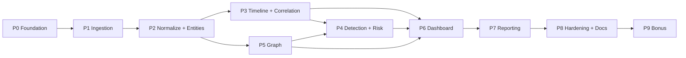

# 08 — Implementation Planning Document

**Project:** AI-Powered Financial & Telecom Dataset Analyzer (Bank, CDR & IPDR Fusion)
**Problem Statement ID:** ERH26_PS_03 · **Domain:** Big Data and Analytics
**Document status:** Batch C · Draft 1 · 2026-07-06

---

## 1. Purpose

To break the project into ordered, dependency-aware phases with objectives, deliverables, complexity,
and priority — so the team can execute the architecture (Doc 07) against the requirements (Doc 02) in
a sequence that de-risks the hardest pieces first and always keeps a demoable slice.

## 2. Objective

Provide a phased roadmap that guarantees the four PS deliverables (working prototype, fusion dashboard
with a worked example, sample report, documentation) are met, with core (Must) requirements before
optional ones.

## 3. Scope

Phasing, sequencing, and complexity for all requirements FR-1..19 / NFR-1..10. Effort is expressed as
**relative complexity** (Low/Medium/High), not calendar time (team size/velocity unknown — Q).

---

## 4. Guiding principles

- **Vertical slice first:** get one thin end-to-end path (upload → normalize → correlate → view)
  working before broadening formats/detectors.
- **Must before Could:** FR-17/18/19 and NFR-8/10 come last.
- **Unblock with synthetic data:** since samples are pending (Q3), build a synthetic dataset generator
  early so no phase stalls.
- **Every phase ends demoable.**

## 5. Phase Plan

### Phase 0 — Foundation & Scaffolding
| Attribute | Detail |
|-----------|--------|
| Objectives | Repo/folder structure (Doc 09), FastAPI skeleton, PostgreSQL schema for canonical model (Doc 06), config system (W/thresholds/profiles), CI + test harness, **synthetic dataset generator** |
| Deliverables | Running skeleton app; empty pipeline wired; canonical DB migrations; synthetic Bank/CDR/IPDR samples |
| Dependencies | Docs 02, 06, 07, 09 |
| Requirements | NFR-6, NFR-9 (enablers) |
| Complexity | Medium |
| Priority | P0 (must be first) |

### Phase 1 — Ingestion & Parsing
| Attribute | Detail |
|-----------|--------|
| Objectives | Type/format detection; profile registry; parsers for Excel/CSV, PDF, delimited; reject log; parse-summary API |
| Deliverables | Ingest all three types (synthetic + any real samples); per-file parse summary |
| Dependencies | Phase 0 |
| Requirements | FR-1, FR-2, FR-3, FR-4, FR-5, NFR-1 |
| Complexity | High (PDF + heterogeneous layouts) |
| Priority | P0 |

### Phase 2 — Normalization & Entity Resolution
| Attribute | Detail |
|-----------|--------|
| Objectives | Field mapping to canonical model; value normalizers (phone/IP/datetime/amount); narration mining; provenance; identifier graph → resolved entities |
| Deliverables | Canonical events + entities + links persisted; provenance on every record |
| Dependencies | Phase 1 |
| Requirements | FR-6, FR-7, FR-10, NFR-7 |
| Complexity | High |
| Priority | P0 |

### Phase 3 — Unified Timeline & Correlation Engine
| Attribute | Detail |
|-----------|--------|
| Objectives | Per-entity timeline; windowed correlation (call + IP + transfer within W); coincidence persistence |
| Deliverables | **Worked correlation example** (a PS deliverable) on synthetic data |
| Dependencies | Phase 2 |
| Requirements | FR-8, FR-9, NFR-2 |
| Complexity | Medium |
| Priority | P0 |

### Phase 4 — Anomaly & Pattern Detection + Risk Scoring
| Attribute | Detail |
|-----------|--------|
| Objectives | Rule detectors (layering, rapid in-out, structuring, circular flow, mule); feature builder; Isolation Forest; combined risk score with factor breakdown |
| Deliverables | Flagged patterns + per-entity risk scores with explanations |
| Dependencies | Phases 2–3 (needs graph features from Phase 5 for circular-flow → light coupling) |
| Requirements | FR-11, FR-12, FR-13, NFR-3 |
| Complexity | High |
| Priority | P1 |

### Phase 5 — Graph / Network Service
| Attribute | Detail |
|-----------|--------|
| Objectives | Build money-flow & communication graphs; cycles/centrality/communities; drill-down payloads |
| Deliverables | Graph API feeding the dashboard; cycle detection supports Phase 4 circular-flow rule |
| Dependencies | Phase 2 |
| Requirements | FR-10, FR-14 (data), FR-18 (optional) |
| Complexity | Medium |
| Priority | P1 (build alongside Phase 4) |

### Phase 6 — Fusion Dashboard (Frontend)
| Attribute | Detail |
|-----------|--------|
| Objectives | Timeline view, network graph (D3/Cytoscape), filters/search (entity/amount/time/location), entity detail drill-down |
| Deliverables | **Fusion dashboard with the worked example** (PS deliverable) |
| Dependencies | Phases 3–5 |
| Requirements | FR-14, FR-15, NFR-4 |
| Complexity | High |
| Priority | P1 |

### Phase 7 — Reporting
| Attribute | Detail |
|-----------|--------|
| Objectives | Templated forensic report (PDF via WeasyPrint, Word via python-docx) with charts + evidentiary timeline + provenance |
| Deliverables | **Sample forensic report + visual exports** (PS deliverable) |
| Dependencies | Phases 3–6 |
| Requirements | FR-16, NFR-7 |
| Complexity | Medium |
| Priority | P1 |

### Phase 8 — Hardening, Performance & Documentation
| Attribute | Detail |
|-----------|--------|
| Objectives | Performance pass on large synthetic data; indexing; robustness on messy inputs; **documentation of parsers/correlation/scoring** (PS deliverable) |
| Deliverables | Perf report; hardened parsers; complete docs |
| Dependencies | Phases 1–7 |
| Requirements | NFR-1, NFR-5, NFR-9 |
| Complexity | Medium |
| Priority | P1 |

### Phase 9 — Optional / Bonus
| Attribute | Detail |
|-----------|--------|
| Objectives | STR generation; cross-bank/operator risk heat maps; NL query (LLM→DSL); security hardening (auth/masking/audit); Neo4j/Elasticsearch scale upgrades |
| Deliverables | Selected bonus features |
| Dependencies | Phases 1–8 |
| Requirements | FR-17, FR-18, FR-19, NFR-8, NFR-10 |
| Complexity | Medium–High |
| Priority | P2 (only after core complete) |

## 6. Dependency Graph

## 7. Priority ↔ Requirement coverage

| Priority | Requirements | Rationale |
|----------|-------------|-----------|
| P0 (core path) | FR-1..10, NFR-1, NFR-2, NFR-6, NFR-7, NFR-9 | Ingest→normalize→correlate = the PS core |
| P1 (core value) | FR-11..16, NFR-3, NFR-4, NFR-5 | Detection, visualization, reporting = deliverables |
| P2 (optional) | FR-17..19, NFR-8, NFR-10 | Bonus + hardening |

## 8. Milestones ↔ PS Deliverables

| PS Deliverable | Delivered by |
|----------------|--------------|
| Working prototype ingesting all three types | Phases 1–2 |
| Fusion dashboard with worked correlation example | Phases 3, 6 |
| Sample forensic report + visual exports | Phase 7 |
| Documentation (parsers, correlation, scoring) | Phase 8 |

## 9. Assumptions

- `[Assumption]` Complexity is relative; convert to schedule once team size/velocity is known.
- `[Assumption]` Synthetic data is acceptable to unblock phases until real samples arrive (Q3).
- `[Assumption]` Optional/bonus items are out of the critical path.

## 10. Dependencies

- All phases depend on the canonical model (Doc 06) and architecture (Doc 07).
- Phase precision (parser breadth, thresholds) depends on Q1/Q2/Q5.

## 11. Risks

- Ingestion (Phase 1) is the highest-complexity, highest-uncertainty phase — start early, timebox.
- Detection relevance (Phase 4) depends on data/thresholds (Q3/Q5) — rules-first mitigates.
- Frontend (Phase 6) can overrun — Streamlit fallback keeps the demo alive.

## 12. Best Practices

- Keep `main` demoable after every phase; feature-flag optional work.
- Write tests per service against fixture/synthetic data as you go (NFR-9).
- Freeze the canonical model early; changes ripple across phases.

## 13. Future Considerations

- Parallelize/queue heavy phases (detection, graph) at scale.
- Add supervised ML once labeled data exists.

## 14. References

- `02_requirement_analysis.md`, `04_workflow.md`, `06_data_understanding.md`,
  `07_architecture_planning.md`, `09_folder_structure.md`, `10_risk_analysis.md`,
  `11_question_log.md`.
