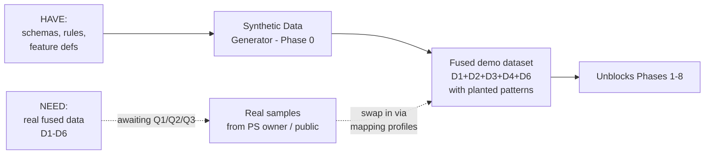
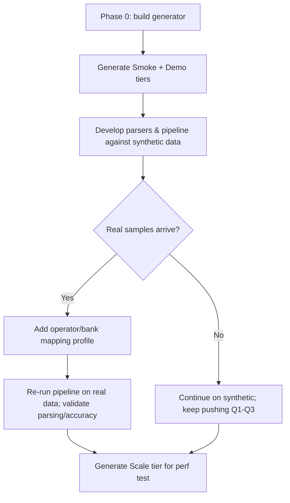

# 12 — Dataset Requirements & Resources

**Project:** AI-Powered Financial & Telecom Dataset Analyzer (Bank, CDR & IPDR Fusion)
**Problem Statement ID:** ERH26_PS_03 · **Domain:** Big Data and Analytics
**Document status:** Supplementary · Draft 1 · 2026-07-06

---

> **One-line answer to "do we need the dataset?":** Yes — data is the raw material of the whole tool.
> But we do **not** need the official data to start: we build a **synthetic dataset** now (matching the
> schemas in Doc 06) and swap in real samples when the PS owner provides them.

## 1. Purpose

To state precisely **what datasets the project needs**, **what we currently have**, the **gap between
the two**, and the **plan + resources** to close that gap — so that no development phase stalls waiting
for data.

## 2. Objective

Give the team a single dataset action plan: required datasets and volumes, an honest inventory of
current resources, candidate external data sources, and a concrete synthetic-data specification that
unblocks Phases 1–8 (Doc 08).

## 3. Scope

The three input datasets (Bank statements, CDR, IPDR) and any supporting/reference data. Field-level
schemas live in [06_data_understanding.md](06_data_understanding.md); this document is about
*acquiring and provisioning* the data, not modeling it.

---

## 4. What we need (dataset requirements)

The tool fuses **three datasets that share entities and time**. The single hardest requirement is not
any one dataset — it is that they **overlap**: the same phone numbers / accounts / IPs and the same
time windows must appear across datasets, or there is nothing to correlate (FR-8, FR-9, FR-10).

| # | Dataset | Needed for | Minimum for demo | Ideal for evaluation |
|---|---------|-----------|------------------|----------------------|
| D1 | **Bank statements** (Excel/PDF/CSV) | FR-1, FR-9, FR-11, FR-16 | 2–3 accounts, ~200–500 txns, ≥2 bank layouts | 10+ accounts, 10k+ txns, 3–4 real layouts |
| D2 | **CDR** (structured/delimited) | FR-2, FR-9, FR-14 | ~5 numbers, ~500 call/SMS records | 20+ numbers, 50k+ records, 2+ operators |
| D3 | **IPDR** (structured/delimited) | FR-3, FR-9 | ~5 subscribers, ~500 sessions | 20+ subscribers, 50k+ sessions, 2+ operators |
| D4 | **Cross-dataset overlap** (the fusion bridge) | FR-8, FR-9, FR-10 | Shared phone numbers + coincident timestamps across D1–D3 | Rich overlap incl. UPI/IMEI/IP linkage |
| D5 (support) | **Reference/lookup data** | FR-15 (location), enrichment | Cell-tower→location map; IP-geo (optional) | Operator/circle lookups, watchlists |
| D6 (support) | **Labels / ground truth** | NFR-3 (measure true vs false positives), FR-11 | A few known-suspicious entities flagged | Labeled suspicious/benign set |

**Critical insight:** No public dataset combines bank + CDR + IPDR **for the same people at the same
times**. That fused, entity-linked, time-coincident quality (D4) is what this project is judged on —
and it is precisely what we must **generate synthetically** if it is not supplied.

## 5. What we currently have (resource inventory)

| Resource | Status | Notes |
|----------|--------|-------|
| Official/real Bank, CDR, IPDR datasets | ❌ **None provided** | Open item **Q3** in [Question Log](11_question_log.md) |
| **Modeled canonical + source schemas** | ✅ Have | [06_data_understanding.md](06_data_understanding.md) §4–7 — full field lists (assumption-based) |
| **Validation rules & normalization spec** | ✅ Have | Doc 06 §9–10 |
| **Feature/pattern definitions** | ✅ Have | Doc 06 §11 + `config/scoring_rules.yaml` plan (Doc 09) |
| **Synthetic data generator** | ⏳ Planned, not built | Phase 0 deliverable (Doc 08); spec in §8 below |
| **Format specs for real operator/bank exports** | ❌ None | Open items **Q1, Q2** |
| **Ground-truth labels** | ❌ None | Open item (part of Q3/Q5); synthetic data gives us labels for free |

**Summary:** We have the *knowledge* (schemas, rules, features) but **zero actual rows**. The gap is
closed by building the synthetic generator — which also hands us **free ground-truth labels** because
we control which entities are "guilty."

## 6. Gap analysis

- **Blocking gap:** none for development — synthetic data removes the blocker.
- **Quality gap:** final accuracy/robustness claims (NFR-1, NFR-3) need at least *some* real samples;
  keep pressing Q1–Q3.

## 7. External data resources (candidate real sources)

> ⚠️ **Verify before use.** These are *candidate* public datasets from domain knowledge; availability,
> licensing, and exact contents must be confirmed at download time (I have not fetched them). **None are
> Indian-format, and none are pre-fused across bank+CDR+IPDR** — so they help with *realism of one
> dataset type at a time*, not with the fusion bridge (D4).

### 7.1 Financial / AML (for D1, D6)
| Resource | What it offers | Caveat |
|----------|----------------|--------|
| **PaySim** (Kaggle) | Synthetic mobile-money transactions with fraud labels | Not bank-statement layout; no telecom link |
| **IBM "Transactions for Anti-Money Laundering" / AMLSim** | Synthetic AML transaction graphs with laundering labels | Graph/txn only; no CDR/IPDR |
| **Credit Card Fraud (ULB, Kaggle)** | Labeled fraud txns | PCA-anonymized; not statement format |
| **IEEE-CIS Fraud Detection (Kaggle)** | Labeled fraud txns | E-commerce, not bank statements |
| Bank **statement templates/samples** from bank websites | Real layouts (PDF/Excel) for parser testing | Empty/sample data, no fraud, no linkage |

### 7.2 Telecom CDR (for D2)
| Resource | What it offers | Caveat |
|----------|----------------|--------|
| **Telecom Italia "Big Data Challenge" (Milan CDR)** | Large aggregated CDR-style activity | Aggregated grid cells, not per-number records |
| **MIT Reality Mining** | Call/proximity logs for ~100 users | Old; research consent scope |
| **CRAWDAD** archive | Various mobility/telecom traces | Mixed formats; licensing per dataset |
| **Orange D4D (Data for Development)** | CDR from Ivory Coast/Senegal | Access-restricted; not Indian |

### 7.3 Network / IPDR-like (for D3)
| Resource | What it offers | Caveat |
|----------|----------------|--------|
| **CICIDS 2017/2018**, **UNSW-NB15** | Network flow records (NetFlow-like) | Intrusion focus, not carrier IPDR |
| **CAIDA**, **MAWI** traces | Internet flow/packet traces | Not subscriber-attributed IPDR |

### 7.4 Suggested datasets & corresponding resources (with sources)

> ⚠️ **Verify links & licences at download.** URLs are the canonical/known locations from domain
> knowledge; confirm availability, licence, and contents before use. Prefer datasets with an explicit
> open/research licence for a hackathon.

**Financial / AML (→ D1 Bank, D6 Labels)**

| Suggested dataset | Resource / source | Why suggested | Licence (verify) |
|-------------------|-------------------|---------------|------------------|
| **PaySim** synthetic mobile-money | kaggle.com/datasets/ealaxi/paysim1 | Labeled fraud, transaction-like, large; good for anomaly-model sanity checks | Open (Kaggle) |
| **IBM Transactions for AML (AMLworld)** | kaggle.com/datasets/ealtman2019/ibm-transactions-for-anti-money-laundering-aml | Realistic laundering typologies + labels; matches our pattern list | Open (Kaggle) |
| **AMLSim** generator | github.com/IBM/AMLSim | *Generates* AML transaction graphs — reusable for our synthetic backbone | Apache-2.0 |
| **Credit Card Fraud (ULB)** | kaggle.com/datasets/mlg-ulb/creditcardfraud | Classic labeled fraud baseline | Open (DbCL) |
| **IEEE-CIS Fraud Detection** | kaggle.com/competitions/ieee-fraud-detection | Rich features + labels | Competition rules |
| **Real bank statement layouts** | Individual bank websites → "sample statement" PDFs/Excel | Real *layouts* to harden parsers (FR-1, NFR-1) | Sample/empty data |

**Telecom CDR (→ D2)**

| Suggested dataset | Resource / source | Why suggested | Licence (verify) |
|-------------------|-------------------|---------------|------------------|
| **Telecom Italia "Big Data Challenge" (Milan)** | dandelion.eu / Harvard Dataverse (search "Telecommunications - SMS, Call, Internet - MI") | Large call/SMS/internet activity; realistic telecom volume | Open (research) |
| **MIT Reality Mining** | realitycommons.media.mit.edu | Per-user call logs — closest to per-number CDR | Research consent |
| **CRAWDAD** archive | crawdad.org | Multiple telecom/mobility traces | Per-dataset |
| **Orange D4D** | (application-based access) | CDR at scale | Restricted |

**Network / IPDR-like (→ D3)**

| Suggested dataset | Resource / source | Why suggested | Licence (verify) |
|-------------------|-------------------|---------------|------------------|
| **CICIDS 2017 / CSE-CIC-IDS2018** | unb.ca/cic/datasets/ids-2017.html | Flow records (IP, port, time, bytes) — closest to IPDR fields | Open (attribution) |
| **UNSW-NB15** | research.unsw.edu.au/projects/unsw-nb15-dataset | Labeled network flows | Open (research) |
| **CAIDA / MAWI** | caida.org / mawi.wide.ad.jp | Internet flow/packet traces | Registration/research |

**Fused Bank+CDR+IPDR (→ D4, the fusion bridge)**

| Suggested approach | Resource / source | Why suggested | Licence |
|--------------------|-------------------|---------------|---------|
| **Our own synthetic generator** (§8) | `tools/synthetic_data_generator/` (build) | **The only source that produces all three, entity-linked and time-coincident, with labels** | Ours |

**Recommended pick per need (fastest path):**

| Need | Primary pick | Secondary (realism/validation) |
|------|--------------|-------------------------------|
| D1 Bank | **Synthetic generator** | Real bank *layout* samples + IBM-AML for pattern realism |
| D2 CDR | **Synthetic generator** | Telecom Italia / Reality Mining for volume realism |
| D3 IPDR | **Synthetic generator** | CICIDS/UNSW-NB15 for field realism |
| D4 Fusion bridge | **Synthetic generator (only viable option)** | — |
| D6 Labels | **Synthetic generator (free labels)** | PaySim / IBM-AML labels |

**Conclusion on external sources:** useful for **parser realism** (one type at a time) and for
**anomaly-model sanity checks**, but the **fused, entity-linked, time-coincident** dataset the PS
requires does not exist publicly → **synthetic generation is the primary path** (recommended below),
with the public datasets above as *realism references and model sanity checks*.

## 8. Recommended plan — Synthetic Dataset Generator (Phase 0)

**Recommendation:** Build a generator that produces all three datasets **for one shared population of
entities over one shared time span**, deliberately planting known suspicious patterns. This is the
only way to get a correlated, labeled, demo-ready dataset now.

### 8.1 Generator design
1. **Create a population of entities** — N persons, each with: 1–2 phone numbers, 1–2 bank accounts,
   UPI IDs, IMEI(s), and IP-session behavior. This is the **shared identity backbone** (gives us D4).
2. **Generate benign activity** — normal calls, data sessions, and transactions with realistic
   distributions (amounts, durations, day/night patterns).
3. **Plant labeled fraud scenarios** (gives us D6 for free):
   - **Mule account:** money in → quickly out to many payees.
   - **Layering / rapid in-and-out:** funds hop through several accounts fast.
   - **Structuring:** many transfers just below a reporting threshold.
   - **Circular flow:** A→B→C→A money loop.
   - **The signature fusion case:** a **call → (online from an IP) → transfer within W minutes**
     coincidence — the exact "decisive evidence" the PS describes (FR-9).
4. **Emit in target formats:** Bank → Excel + PDF + CSV (varied layouts); CDR → delimited/CSV;
   IPDR → delimited/CSV — matching Doc 06 schemas so parsers are exercised realistically.
5. **Emit a ground-truth file** listing which entities/transactions are suspicious and why → measures
   NFR-3 (true vs false positives).

### 8.2 Suggested volumes
| Tier | Entities | Bank txns | CDR records | IPDR sessions | Use |
|------|----------|-----------|-------------|---------------|-----|
| Smoke | 5 | ~200 | ~300 | ~300 | Unit tests, quick demo |
| Demo | ~30 | ~5k | ~10k | ~10k | Fusion dashboard demo, worked example |
| Scale | ~200+ | 100k+ | 100k+ | 100k+ | Performance/scalability test (NFR-5) |

### 8.3 Where it lives
`tools/synthetic_data_generator/` → outputs to `data/samples/` (see [09_folder_structure.md](09_folder_structure.md)).

## 9. Data provisioning workflow

## 10. Action items (data)

| # | Action | Owner | Priority |
|---|--------|-------|----------|
| A1 | Ask PS owner for ≥1 real sample per type + format specs (Q1–Q3) | Team lead | High |
| A2 | Build synthetic generator (Phase 0) covering D1–D4 + D6 | Backend/Data eng | High |
| A3 | Produce Smoke + Demo tiers; commit to `data/samples/` | Data eng | High |
| A4 | Collect 2–3 real **bank statement layout samples** (public templates) for parser realism | Team | Medium |
| A5 | Evaluate PaySim / IBM-AML for anomaly-model sanity checks | ML | Low |
| A6 | Produce Scale tier for NFR-5 performance testing | Data eng | Medium |

## 11. Assumptions

- `[Assumption]` No real datasets are available at project start (Q3); synthetic data is acceptable to
  develop and demo against.
- `[Assumption]` Synthetic schemas follow Doc 06; real data will map in via profiles with minimal rework.
- `[Assumption]` Currency INR, timezone IST, Indian numbering — consistent with Docs 01/06.

## 12. Dependencies

- Depends on schemas & rules in [06_data_understanding.md](06_data_understanding.md).
- Feeds every build phase in [08_implementation_planning.md](08_implementation_planning.md) (Phase 0
  gates Phases 1–8).
- Blocked for *final accuracy validation* on Q1–Q3 ([Question Log](11_question_log.md)).

## 13. Risks

- **DR-R1 (no real data):** mitigated by synthetic generator (see [10_risk_analysis.md](10_risk_analysis.md)).
- **DR-R2 (weak fusion bridge):** synthetic data guarantees the bridge; real data may not — track as a
  coverage metric.
- **Synthetic-only bias:** models tuned only on synthetic data may not generalize → keep design
  rules-first/explainable and validate on any real sample obtained.

## 14. Best Practices

- Generate data **entity-first** (shared identities) so fusion is real, not bolted on.
- Always emit **ground-truth labels** alongside synthetic data.
- Vary layouts/formats deliberately to harden parsers (NFR-1).
- Never commit real case data to version control (Doc 09 §6).

## 15. Future Considerations

- Parameterize the generator to mimic specific operator/bank layouts once real specs (Q1) arrive.
- Add enrichment sources (IP-geo, cell-tower maps, watchlists) for FR-15/optional features.

## 16. References

- [01_problem_statement_analysis.md](01_problem_statement_analysis.md),
  [06_data_understanding.md](06_data_understanding.md),
  [08_implementation_planning.md](08_implementation_planning.md),
  [09_folder_structure.md](09_folder_structure.md),
  [10_risk_analysis.md](10_risk_analysis.md),
  [11_question_log.md](11_question_log.md).
- Candidate public datasets (verify at use): PaySim, IBM AML/AMLSim, ULB Credit-Card Fraud, IEEE-CIS,
  Telecom Italia Big Data Challenge, MIT Reality Mining, CRAWDAD, Orange D4D, CICIDS, UNSW-NB15, CAIDA.
