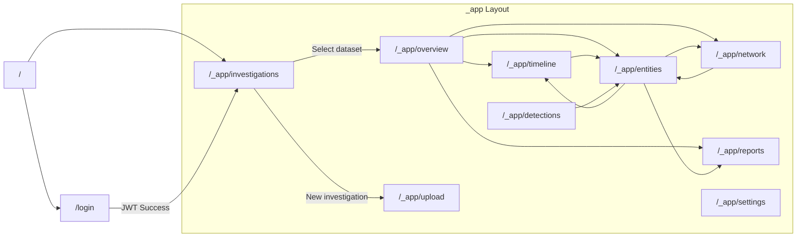

# App Flow — Navigation & User Journey

**Project:** ERakshak — Frontend Redesign
**Version:** 1.0 · 2026-07-17

---

## Navigation Graph



---

## Screen Inventory

### 1. Login (`/login`)

| Attribute | Detail |
|-----------|--------|
| **Purpose** | Authenticate analyst; gate access to investigation surfaces |
| **Data loaded** | None (public route) |
| **API calls** | `POST /v1/auth/token` on submit |
| **Entry points** | Direct URL; redirect from any protected route |
| **Exit points** | → `/investigations` on successful login |
| **Key interactions** | Username/password form; error message on failure; "Cannot reach API" fallback |
| **Auth state** | Token + username stored in `localStorage` |

### 2. Investigations (`/_app/investigations`)

| Attribute | Detail |
|-----------|--------|
| **Purpose** | Case registry — show all available datasets; pick one to investigate |
| **Data loaded** | `GET /v1/datasets` → list of folder names; then `POST /v1/analyze` for each (parallel) |
| **KPIs displayed** | Open cases, Total events fused, High-risk entities, API status |
| **Table columns** | Case code, Title, Status, Datasets (bank/cdr/ipdr counts), Entities, Events, Hits, Top Risk, Updated |
| **Key interactions** | Search/filter datasets; click row → set active dataset + navigate to Overview; "New investigation" → Upload |
| **Exit points** | Click row → `/overview`; "New investigation" → `/upload` |
| **State changes** | Sets `InvestigationContext.dataset` on row click |

### 3. Overview (`/_app/overview`)

| Attribute | Detail |
|-----------|--------|
| **Purpose** | Command center — case-level KPIs, money flow chart, risk distribution, top entities, recent correlation hits |
| **Data loaded** | `POST /v1/analyze` (via `useAnalyze()`) |
| **API response consumed** | `summary`, `file_counts`, `money_flow_series`, `correlation_hits`, `top_risk` |
| **Sections** | 5 KPI cards → Money Flow Area Chart + Risk Distribution Bar Chart → Top Entities Table + Correlation Hits List |
| **Key interactions** | Click entity row → `/entities`; click "Timeline" → `/timeline`; click "Network" → `/network`; click "Export report" → `/reports` |
| **Exit points** | Sidebar navigation; action buttons in header |

### 4. Upload & Ingest (`/_app/upload`)

| Attribute | Detail |
|-----------|--------|
| **Purpose** | Upload Bank/CDR/IPDR files to create a new investigation dataset |
| **Data loaded** | (Currently mock/placeholder — no upload API endpoint) |
| **Key interactions** | File drop zones; format auto-detection preview; parse summary |
| **Limitation** | Backend has no file upload endpoint. This page is a UI shell. |
| **Exit points** | After upload completion → `/overview` (when wired) |

### 5. Timeline (`/_app/timeline`)

| Attribute | Detail |
|-----------|--------|
| **Purpose** | Per-day 24-hour unified timeline showing all events across 3 tracks (transactions, calls, IP sessions) with correlation window overlays |
| **Data loaded** | `GET /v1/events/{ds}` (via `useEvents()`) + `POST /v1/analyze` (for correlation windows) |
| **Visual structure** | 24h time axis (0:00–24:00) → 3 horizontal tracks → event dots positioned by minute → highlighted bands = correlation windows |
| **Key interactions** | Toggle track visibility (txn/call/ip); click event dot → Event Detail panel (right); correlation bands show window W boundaries |
| **Detail panel shows** | Timestamp, event type, entity name, attributes (amount, from/to, duration, bytes), provenance (source file:row) |
| **Exit points** | Sidebar; entity name links → `/entities` |

### 6. Network Graph (`/_app/network`)

| Attribute | Detail |
|-----------|--------|
| **Purpose** | Interactive node-link diagram showing money-flow and communication relationships between entities |
| **Data loaded** | `GET /v1/graph/{ds}` (via `useGraph()`) |
| **Visual structure** | SVG canvas with nodes (circles, sized by risk, colored by risk band) + edges (money=teal, communication=amber, shared_id=dashed) |
| **Mode toggle** | Money Flow / Communication — filters visible edges |
| **Node interaction** | Click → select node → right panel shows node detail (risk score, ID, kind, neighbors list with edge weights) |
| **Neighbor navigation** | Click neighbor in panel → re-centers selection |
| **Legend** | Bottom-left overlay: edge type color key |
| **Exit points** | "Expand subgraph" button (placeholder); sidebar navigation |

### 7. Entity Explorer (`/_app/entities`)

| Attribute | Detail |
|-----------|--------|
| **Purpose** | Master-detail explorer for all resolved entities with search, risk scoring, identifiers, and flags |
| **Data loaded** | `GET /v1/entities/{ds}` (via `useEntities()`) |
| **Left panel** | Searchable table: Entity (icon + label + kind), Primary identifier, Txn count, Risk badge |
| **Right panel** | Selected entity detail: Name, kind, event count, volume, Risk Gauge (0–100 visual), Resolved Identifiers list (type → value), Risk Factors (rule flags), Action buttons (Open timeline, Show on graph, Add to report) |
| **Search** | Client-side filter across label + identifier values |
| **Key interactions** | Click row → select entity; search → filter list; action buttons → navigate with entity context |
| **Exit points** | "Open timeline" → `/timeline`; "Show on graph" → `/network`; "Add to report" → `/reports` |

### 8. Detections (`/_app/detections`)

| Attribute | Detail |
|-----------|--------|
| **Purpose** | Aggregated view of all detection rules that fired, with severity, entity count, and evidence |
| **Data loaded** | `GET /v1/entities/{ds}` → `mapDetections()` aggregates `rule_flags` across all entities |
| **Structure** | Filter bar (All / High / Medium / Low) → List of detection cards |
| **Card contents** | Rule name, severity badge, weight, description, entity count, evidence count |
| **Exit points** | Sidebar; future: click entity count → filtered entity list |

### 9. Reports (`/_app/reports`)

| Attribute | Detail |
|-----------|--------|
| **Purpose** | Forensic report preview with placeholders for PDF/Word/STR export |
| **Data loaded** | `POST /v1/analyze` (via `useAnalyze()`) |
| **Left panel** | Print-styled report preview (white background, serif-ish presentation) — Case narrative, Top entities table, Correlation hits list |
| **Right panel** | Summary stats |
| **Export buttons** | "Export STR (.docx)" and "Export Forensic Report (PDF)" — both show toast "not wired to API yet" |
| **Exit points** | Sidebar navigation |

### 10. Settings (`/_app/settings`)

| Attribute | Detail |
|-----------|--------|
| **Purpose** | Configuration panel for correlation window, API URL, theme |
| **Data loaded** | Current `InvestigationContext` values |
| **Key interactions** | Adjust window W; change API URL; (placeholder for more) |

---

## Key User Journeys

### Journey 1: First-Time Login

```
User opens app → / redirects to /login
  → Enters credentials (admin / adminpass)
  → POST /v1/auth/token → JWT stored
  → Redirect to /investigations
  → GET /v1/datasets → Shows available datasets
  → For each dataset, POST /v1/analyze → Shows summary stats
```

### Journey 2: Opening an Investigation

```
User clicks dataset row in /investigations
  → InvestigationContext.setDataset("demo")
  → Navigate to /overview
  → POST /v1/analyze(demo, 10) → Loading spinner (5-30s)
  → Overview renders: 5 KPIs, money flow chart, risk distribution,
    top 6 entities table, recent correlation hits
```

### Journey 3: Entity Drill-Down

```
User sees high-risk entity "Rakesh V." in overview table
  → Clicks entity row → Navigate to /entities
  → GET /v1/entities/demo → Entity table loads
  → Clicks "Rakesh V." row → Right panel shows:
    - 4 resolved identifiers (HDFC account, phone, UPI, IMEI)
    - Risk score 92 (gauge)
    - 4 rule flags: structuring, rapid-in-out, coincidence, mule
  → Clicks "Open timeline" → /timeline (filtered to Rakesh V.)
  → Sees events clustered around 09:12-09:14 window
  → Clicks event dot → Detail panel shows txn of ₹1.99L to Sanya Traders
```

### Journey 4: Correlation Review

```
User is on /overview → Sees correlation hits panel
  → Hit: "09:12 IST — Rakesh V. ↔ Sanya Traders — Δ +2m 18s"
  → Events: call + ip + txn within W=10m
  → User clicks to /timeline to see the three events on the axis
  → Correlation window highlighted as a teal band
  → User clicks to /network → Money flow edge from Rakesh → Sanya
```

### Journey 5: Report Export (Future)

```
User navigates to /reports
  → Report preview renders from analyze data
  → Clicks "Export Forensic Report (PDF)"
  → POST /v1/report/export (when API is wired)
  → Downloads PDF with case narrative, entities, evidence, provenance
```

---

## Data Dependencies Per Screen

| Screen | Primary Query | Secondary Queries |
|--------|--------------|-------------------|
| Investigations | `useDatasets()` | `useAnalyze()` per dataset |
| Overview | `useAnalyze()` | — |
| Timeline | `useEvents()` | `useAnalyze()` (for correlation windows) |
| Network | `useGraph()` | — |
| Entities | `useEntities()` | — |
| Detections | `useEntities()` | — (derived client-side) |
| Reports | `useAnalyze()` | — |
| Upload | — | — |
| Settings | — | — |

### Loading Waterfall

```
Login → JWT → Investigations → GET /datasets → POST /analyze (per dataset)
                  ↓ (click row)
              Overview → POST /analyze → (single, cached)
                  ↓ (click Timeline)
              Timeline → GET /events + POST /analyze (correlation windows)
```

All queries for the same `(dataset, window)` pair share a single cache entry. Navigation within a case does not re-fetch.
