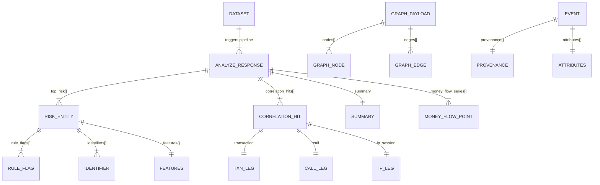

# Backend Schema & API Consumption Guide

**Project:** ERakshak — Frontend Redesign
**Version:** 1.0 · 2026-07-17

---

## API Overview

- **Base URL:** `http://127.0.0.1:8000` (configurable via `VITE_API_BASE_URL`)
- **Auth:** JWT Bearer token via `POST /v1/auth/token`
- **Versioning:** All data endpoints under `/v1`
- **Error schema:** `{ error: { code: number, message: string } }`
- **CORS:** Allows `localhost:5173`, `localhost:8080`, `localhost:4173`

---

## Authentication

### `POST /v1/auth/token`

**Request:** `Content-Type: application/x-www-form-urlencoded`

```
username=admin&password=adminpass
```

**Response (200):**
```json
{
  "access_token": "eyJhbGciOi...",
  "token_type": "bearer"
}
```

**Frontend Type:**
```typescript
type TokenResponse = { access_token: string; token_type: string };
```

**Notes:**
- OAuth2 password flow
- Default credentials: `admin` / `adminpass` and `analyst` / `analystpass`
- Token includes `username` and `roles` claims
- No refresh endpoint — on expiry, user must re-login
- All subsequent requests: `Authorization: Bearer <token>`

---

## Datasets

### `GET /v1/datasets`

**Response (200):**
```json
{
  "datasets": ["demo", "smoke", "scale"]
}
```

**Consumption:** Used by the Investigations page to list available datasets. Each name is a folder under `datasets/raw/`.

---

## Analyze (The Primary Endpoint)

### `POST /v1/analyze`

This is the **most important endpoint**. It runs the full pipeline and returns a comprehensive analysis payload.

**Request:**
```json
{
  "dataset": "demo",
  "window_minutes": 10,
  "persist": false
}
```

**Response (200) — Full Shape:**
```json
{
  "dataset": "demo",
  "window_minutes": 10,
  "summary": {
    "files": 6,
    "events": 2834,
    "transactions": 1200,
    "calls": 980,
    "ip_sessions": 654,
    "rejects": 3,
    "entities": 104,
    "correlation_hits": 47,
    "transfers": 89,
    "high_risk_entities": 12
  },
  "file_counts": {
    "bank": 2,
    "cdr": 2,
    "ipdr": 2,
    "other": 0
  },
  "money_flow_series": [
    { "t": "Sep 01", "inflow": 2.1, "outflow": 1.9 },
    { "t": "Sep 04", "inflow": 3.4, "outflow": 3.2 }
  ],
  "correlation_hits": [
    {
      "entity_id": "uuid-...",
      "entity_label": "Rakesh V.",
      "window_minutes": 10,
      "transaction": {
        "time": "2025-09-01T09:14:22+05:30",
        "amount": 199000,
        "direction": "DEBIT",
        "ref_no": "UTR123456",
        "provenance": {
          "source_file": "hdfc_stmt_sep.xlsx",
          "sheet": "Sheet1",
          "row": 442
        }
      },
      "call": {
        "time": "2025-09-01T09:12:04+05:30",
        "counterparty_entity_id": "uuid-...",
        "provenance": {
          "source_file": "cdr_airtel_sep.csv",
          "row": 2214
        }
      },
      "ip_session": {
        "start": "2025-09-01T09:12:41+05:30",
        "end": "2025-09-01T09:13:01+05:30",
        "ip": "10.14.22.9",
        "provenance": {
          "source_file": "ipdr_jio_sep.csv",
          "row": 9021
        }
      },
      "explanation": "Call + IP session + DEBIT within 10m window"
    }
  ],
  "top_risk": [
    {
      "entity_id": "uuid-...",
      "label": "Rakesh V.",
      "risk_score": 92.4,
      "band": "high",
      "ml_score": 0.87,
      "rule_flags": [
        { "rule": "structuring", "detail": "12 txns just under 50k", "weight": 0.22 },
        { "rule": "rapid_in_out", "detail": "pass-through ratio 94%", "weight": 0.24 }
      ],
      "features": {
        "txn_count": 412,
        "total_in": 8200000,
        "total_out": 7900000,
        "coincidence_count": 8,
        "call_count": 89,
        "ip_session_count": 56
      },
      "identifiers": [
        { "kind": "ACCOUNT_NO", "value": "HDFC 5001 2244 8890" },
        { "kind": "PHONE", "value": "+919810422118" },
        { "kind": "UPI_ID", "value": "rakesh.v@okhdfc" },
        { "kind": "IMEI", "value": "358240051111110" }
      ],
      "types": ["ACCOUNT_NO", "IMEI", "PHONE", "UPI_ID"],
      "external": false,
      "event_count": 420,
      "volume": 16100000.0,
      "txn_count": 412
    }
  ]
}
```

### Frontend Types (from [api.ts](file:///c:/Users/tarun/OneDrive/Documents/E-Rakshak/frontend/src/lib/api.ts))

```typescript
type AnalyzeSummary = {
  files: number;
  events: number;
  transactions: number;
  calls: number;
  ip_sessions: number;
  rejects: number;
  entities: number;
  correlation_hits: number;
  transfers: number;
  high_risk_entities: number;
};

type RuleFlag = { rule: string; detail: string; weight: number };
type IdentifierDto = { kind: string; value: string };

type RiskEntity = {
  entity_id: string;
  label: string | null;
  risk_score: number;
  band: "low" | "medium" | "high";
  ml_score: number;
  rule_flags: RuleFlag[];
  features: Record<string, number | null | undefined>;
  identifiers?: IdentifierDto[];
  types?: string[];
  external?: boolean;
  event_count?: number;
  volume?: number;
  txn_count?: number;
};

type CorrelationHitDto = {
  entity_id: string;
  entity_label?: string | null;
  window_minutes: number;
  transaction: {
    time: string;
    amount?: number | null;
    direction?: string | null;
    ref_no?: string | null;
    provenance?: Record<string, unknown>;
  };
  call: {
    time: string;
    counterparty_entity_id?: string | null;
    provenance?: Record<string, unknown>;
  };
  ip_session: {
    start: string;
    end?: string | null;
    ip?: string | null;
    provenance?: Record<string, unknown>;
  };
  explanation?: string;
};

type AnalyzeResponse = {
  dataset: string;
  window_minutes: number;
  summary: AnalyzeSummary;
  file_counts: { bank: number; cdr: number; ipdr: number; other: number };
  money_flow_series: { t: string; inflow: number; outflow: number }[];
  correlation_hits: CorrelationHitDto[];
  top_risk: RiskEntity[];
};
```

---

## Entities

### `GET /v1/entities/{ds}?window=10&limit=200&offset=0`

**Response (200):**
```json
{
  "total": 104,
  "items": [/* array of RiskEntity objects, same shape as top_risk above */]
}
```

**Sorted by:** `risk_score` descending (server-side).

**Pagination:** Offset-based. `limit` max 500.

### Frontend Mapper: `mapEntity()`

[mappers.ts](file:///c:/Users/tarun/OneDrive/Documents/E-Rakshak/frontend/src/lib/mappers.ts) transforms `RiskEntity → Entity`:

| Backend Field | Frontend Field | Transformation |
|---------------|---------------|----------------|
| `entity_id` | `id` | Direct |
| `label` | `label` | Fallback to `entity_id` if null |
| `types` | `kind` | Derived: has both ACCOUNT_NO+PHONE → "individual"; ACCOUNT_NO only → "account"; PHONE only → "phone"; name heuristic → "merchant" |
| `identifiers` | `identifiers` | Mapped via `ID_KIND_MAP` (UPI_ID → UPI) |
| `risk_score` | `risk` | `Number()` |
| `rule_flags[].rule` | `flags` | Extracted rule names |
| `txn_count` or `event_count` or `features.txn_count` | `events` | Fallback chain |
| `volume` | `volume` | `Number()` or 0 |

---

## Events

### `GET /v1/events/{ds}?window=10&limit=400&offset=0&event_type=TRANSACTION`

**Response (200):**
```json
{
  "total": 2834,
  "items": [
    {
      "id": "TRANSACTION:2025-09-01T09:14:22+05:30:uuid-...:442",
      "event_type": "TRANSACTION",
      "timestamp": "2025-09-01T09:14:22+05:30",
      "timestamp_end": null,
      "minute": 554,
      "entity_id": "uuid-...",
      "entity_label": "Rakesh V.",
      "counterparty_entity_id": "uuid-...",
      "amount": 199000,
      "direction": "DEBIT",
      "attributes": {
        "amount": 199000,
        "direction": "DEBIT",
        "primary": "ACCOUNT_NO:HDFC 5001 2244 8890",
        "mode": "IMPS"
      },
      "provenance": {
        "source_file": "hdfc_stmt_sep.xlsx",
        "sheet": "Sheet1",
        "row": 442,
        "offset": null,
        "profile": "bank_hdfc_v1"
      }
    }
  ]
}
```

**Frontend Type:**
```typescript
type EventDto = {
  id: string;
  event_type: string;        // "TRANSACTION" | "CALL" | "IP_SESSION"
  timestamp: string | null;
  timestamp_end?: string | null;
  minute: number | null;      // Pre-computed: hours*60 + minutes
  entity_id?: string | null;
  entity_label?: string | null;
  counterparty_entity_id?: string | null;
  amount?: number | null;
  direction?: string | null;
  attributes: Record<string, unknown>;
  provenance: {
    source_file?: string | null;
    sheet?: string | null;
    row?: number | null;
    offset?: number | null;
    profile?: string | null;
  };
};
```

### Frontend Mapper: `mapEvent()`

| Backend Field | Frontend Field | Transformation |
|---------------|---------------|----------------|
| `id` | `id` | Direct |
| `event_type` | `type` | Map: `TRANSACTION→"txn"`, `CALL→"call"`, `IP_SESSION→"ip"` |
| `timestamp` | `ts` | `toLocaleTimeString("en-IN", {hour12: false})` |
| `minute` | `minute` | Use directly, or compute from timestamp if null |
| `entity_label` or `entity_id` | `entity` | Fallback chain |
| `attributes` | `attrs` | Flatten to `Record<string, string\|number>` |
| `provenance` | `provenance` | Format as `"source_file:R{row}"` |

### Filtering
- `event_type` query param: `TRANSACTION`, `CALL`, `IP_SESSION`
- **No entity_id filter** on the API — must filter client-side

---

## Graph

### `GET /v1/graph/{ds}?window=10`

**Response (200):**
```json
{
  "nodes": [
    {
      "id": "uuid-...",
      "label": "Rakesh V.",
      "risk": 92.4,
      "types": ["ACCOUNT_NO", "PHONE", "UPI_ID", "IMEI"],
      "external": false,
      "community": 0,
      "centrality": 0.42,
      "degree": 8
    }
  ],
  "edges": [
    {
      "source": "uuid-...",
      "target": "uuid-...",
      "kind": "MONEY_FLOW",
      "amount": 1200000,
      "count": 8
    }
  ]
}
```

### Edge Kinds
| Backend Kind | Frontend Kind | Visual |
|--------------|---------------|--------|
| `MONEY_FLOW` | `"money"` | Solid teal line with arrow |
| `COMMUNICATION` | `"comm"` | Solid amber line with arrow |
| `SHARED_IDENTIFIER` | `"shared_id"` | Dashed muted line, no arrow |

### Frontend Mapper: `layoutGraph()`

- Filters to non-external nodes (max 40)
- Computes circular layout: `x = cx + radius * cos(angle)`, `y = cy + radius * sin(angle)`
- Maps edge kinds and derives weight from `count` or `amount`
- **Note:** This is a placeholder layout. Production should use D3 force-directed layout.

---

## Data Relationship Map



---

## API Gotchas & Edge Cases

### 1. First analyze call is slow
The pipeline runs on first request for each `(dataset, window)` pair. Subsequent requests are cached (`@lru_cache`). Budget 5–30 seconds for first analysis.

### 2. Money flow series may be empty
If the dataset has no transactions, `money_flow_series` will be `[]`. Frontend shows a placeholder "—".

### 3. Inflow/outflow are in crores
Values are divided by 1e7 on the backend: `round(amount / 1e7, 3)`. Frontend displays as-is with "₹ Cr" label.

### 4. Entity volume is in raw rupees
`volume` on `RiskEntity` is `total_in + total_out` in raw rupees. Frontend converts: `₹ {(volume / 100000).toFixed(1)}L` for lakhs display.

### 5. Risk score is 0–100 float
Displayed as integer in most places. The composite formula is `70% rule_score + 30% ml_score`.

### 6. Rule flag weights are fractional
`weight` on `RuleFlag` is a fraction (0.0–1.0) representing contribution to the rule score. Frontend multiplies by 100 for display: `Math.round(flag.weight * 100)`.

### 7. Identifiers may be empty
Some entities (especially external counterparties) have no identifiers. Frontend falls back to `[{ kind: "ACCOUNT_NO", value: entity_id }]`.

### 8. Correlation hit score is synthetic
The frontend `mapHit()` computes a display score: `Math.min(99, 70 + Math.round(window_minutes / 2))`. This is not from the backend — it's a heuristic for display ranking.

### 9. Event `minute` field
Pre-computed by the backend as `hours * 60 + minutes` for timeline placement. May be null if timestamp is null.

### 10. External entities in graph
Nodes with `external: true` represent counterparties seen in data but not primary investigation subjects. The `layoutGraph()` function filters them out. Consider showing them as dimmed or smaller nodes.

### 11. Community detection
Graph nodes include a `community` integer (from NetworkX community detection). Can be used for cluster coloring. Not currently used in the frontend.

### 12. Centrality and degree
Graph nodes include `centrality` (betweenness centrality 0–1) and `degree` (edge count). These can drive node sizing more accurately than risk alone.
